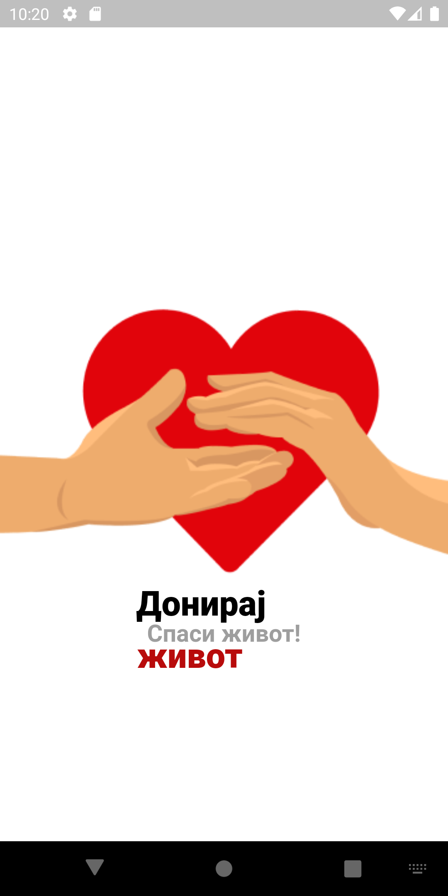
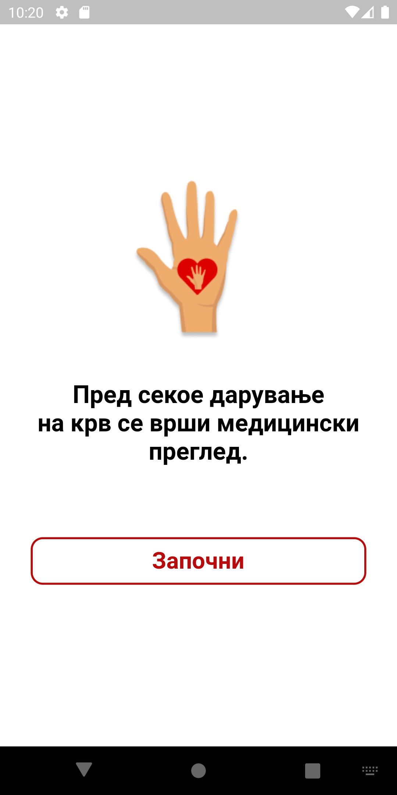
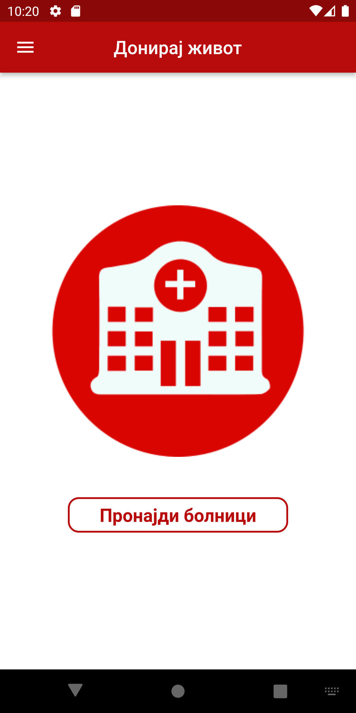
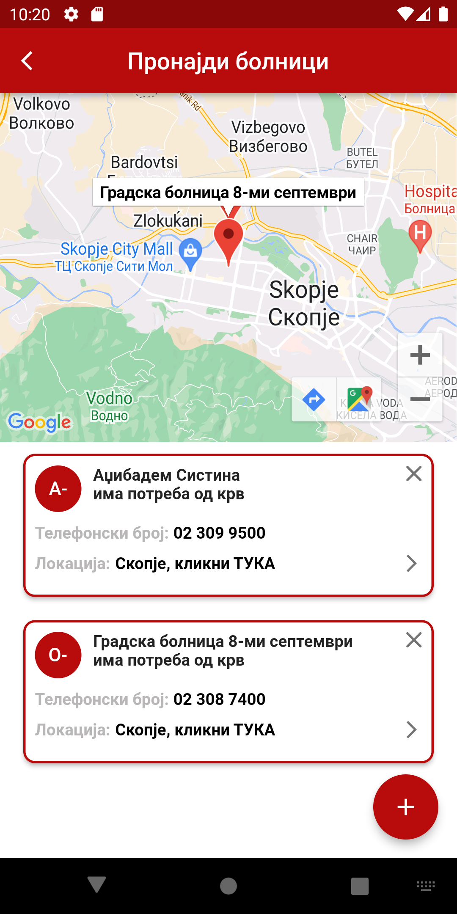
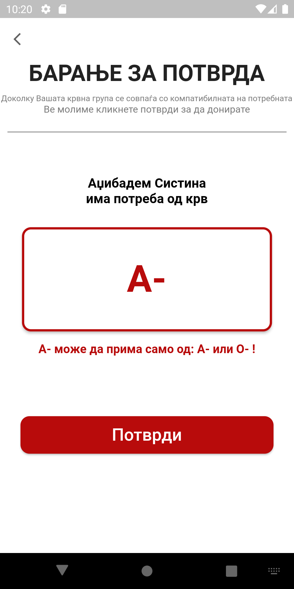
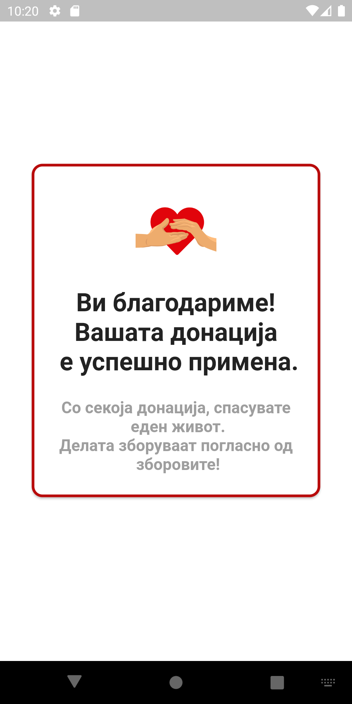
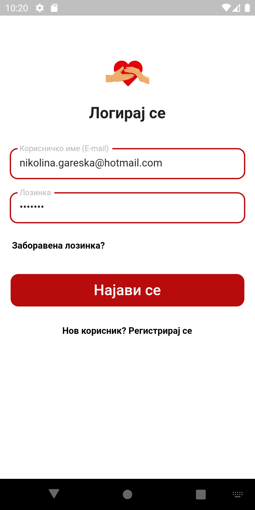
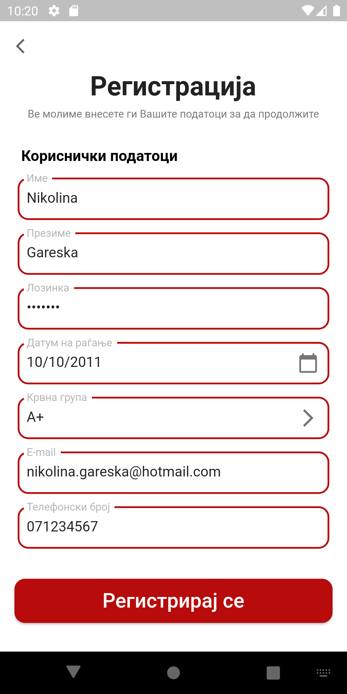
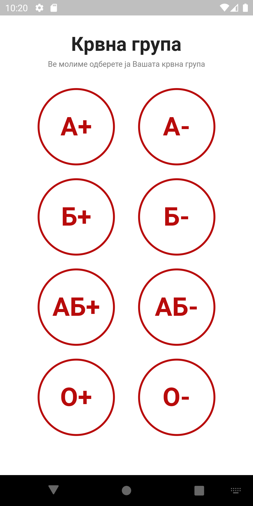

# Donate Life Mobile Application
**Donate Life** is an application designed to help users determine their eligibility for blood donation, identify the necessary criteria, and locate the nearest hospital where they can make a blood donation.

## Developing in Android Studio
To work with the Donate Life application in Android Studio, follow these steps:

1. Clone the Repository: Start by cloning the application's GitHub repository to your local machine. You can use the following command to clone the repository:

> git clone https://github.com/ngareska/donate-life.git

2. Open in Android Studio: Open Android Studio and select "Open an existing Android Studio project." Navigate to the directory where you cloned the repository and select the project's root folder.

3. Configure Emulator or Device: Ensure that you have an Android emulator or physical device set up for testing. If you don't have one, you can create an emulator within Android Studio.

4. Build and Run: Build the project by selecting "Build" from the menu and then click "Run" to deploy the application on the emulator or device. Make sure you've chosen an appropriate configuration for the app.

## Features
### User Models
- ` BloodTypes: ` Represents different blood types and includes a list of all blood type options.
- ` Hospital: ` Contains information about hospitals, including unique IDs, names, locations, required blood types, phone numbers, and coordinates.
- `Location: ` Represents geographic coordinates.
- `User:` Stores user information, including names, passwords, birthdates, email addresses, blood types, and phone numbers.

## Main Screens and Widgets

### Home Page
- Features an app bar with the title "Донирај живот" (Donate Life).
- Offers a side drawer with an icon for logging out.
- Contains a hospital image and a search button for finding hospitals.

### Hospitals Page
- Displays hospitals on a map and in a list.
- Provides functionality to view details, search for hospitals on the map, add new hospitals, and remove existing ones.
- Includes a floating action button to add new hospitals.

### Confirmation Page
- Shows details of the selected hospital and the required blood type.
- Helps users confirm their blood compatibility with the requested blood type.

### Success Page
- Displays a success message after a successful donation.

### Login Screen
- Allows users to log in with their email and password.
- Features an option to reset a forgotten password.
- Provides a registration option for new users.

### Registration Page
- Enables user registration with personal information such as first name, last name, password, date of birth, blood type, email, and phone number.
- Utilizes a calendar for date of birth selection.
- Redirects to the BloodTypeSelection screen for blood type selection.

### BloodTypeSelection
- Allows users to select their blood type from available options.

